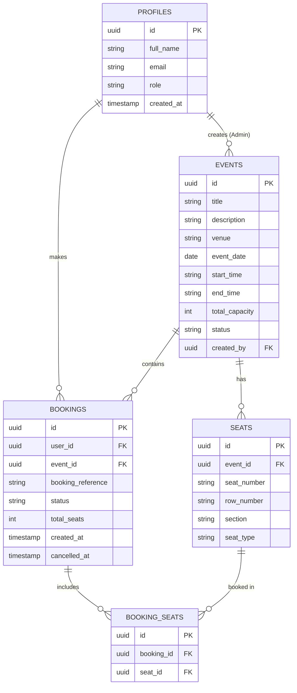

# Full-Stack Event Booking System

A production-ready **Full-Stack Event Booking System** built with **Next.js 15 App Router**, **TypeScript**, **Tailwind CSS**, **Zod**, and **Supabase / PostgreSQL**. 

This system features **atomic seat reservation logic** using PostgreSQL row locking (`FOR UPDATE`) and stored functions (RPC) to completely prevent race conditions, duplicate seat bookings, and overbooking under heavy concurrent traffic.

---

## 🌟 Key Features

### User Capabilities
- **Event Discovery**: Browse upcoming events with search, pagination, and filter by status.
- **Event Details & Seating Matrix**: Interactive visual seating layout displaying real-time `AVAILABLE`, `BOOKED`, and `SELECTED` seats across `STANDARD`, `PREMIUM`, and `VIP` tiers.
- **Atomic Multi-Seat Booking**: Select multiple seats and submit reservations with 100% transaction safety.
- **Booking Management**: View booking receipts, reference codes (`EVT-XXXXXX`), and cancel eligible bookings to instantly release seats back to the pool.

### Admin Capabilities
- **Admin Dashboard**: System-wide analytics (Total Events, Published, Cancelled, Bookings, Booked Seats, Available Seats, and Booking Rate).
- **Event Creation**: Publish new events with automatically generated seat matrices.
- **Event Management**: Update details or soft-cancel events.
- **Booking Oversight**: Inspect all system-wide user reservations and active seat allocations.

### Concurrency & Data Integrity
- **Zero Race Conditions**: Guaranteed single winner when simultaneous users attempt to book the exact same seat.
- **Atomic Rollback**: If any single seat in a multi-seat request is unavailable, the entire transaction is rolled back.

---

## 🏗 Technology Stack

- **Frontend**: Next.js 15 (App Router), React 19, TypeScript, Tailwind CSS, Lucide React
- **Backend API**: Next.js REST API Routes, Zod Schema Validation, JWT Authentication
- **Database**: Supabase / PostgreSQL (Tables, Constraints, Indexes, RLS Policies, Stored RPC Functions)
- **Testing**: Vitest (Unit, Integration, Concurrency Race-Condition Test, Transaction Rollback Test)

---

## 📐 Architecture & Layer Separation

```
┌─────────────────────────────────────────────────────────┐
│                 Frontend Layer (Next.js 15)             │
│  - React Server & Client Components                     │
│  - Tailwind CSS UI & Interactive Seat Matrix Layout      │
│  - Centralized API Client (lib/api/client.ts)           │
└────────────────────────────┬────────────────────────────┘
                             │ (REST API HTTP Requests)
                             ▼
┌─────────────────────────────────────────────────────────┐
│              REST API & Service Layer                   │
│  - API Routes (app/api/...)                             │
│  - Input Validation with Zod (server/validators)        │
│  - Auth Middleware & Role Checks (server/middleware)    │
│  - Business Services & Repositories (server/services)   │
└────────────────────────────┬────────────────────────────┘
                             │ (PostgreSQL SQL / RPC)
                             ▼
┌─────────────────────────────────────────────────────────┐
│             Database Layer (Supabase / Postgres)        │
│  - Normalized Relational Tables                         │
│  - Row Level Security (RLS) Policies                     │
│  - Stored RPC Functions (create_booking, cancel_booking) │
└─────────────────────────────────────────────────────────┘
```

---

## 🗄 Database Schema & ER Diagram



---

## 🔒 Atomic Booking Function (`create_booking`)

To eliminate race conditions when User A and User B select seat `A10` at the exact same millisecond:

```sql
CREATE OR REPLACE FUNCTION public.create_booking(
    p_user_id UUID,
    p_event_id UUID,
    p_seat_ids UUID[]
) RETURNS JSONB AS $$
BEGIN
    -- 1. Lock Event Row & Verify PUBLISHED Status
    SELECT status FROM public.events WHERE id = p_event_id FOR UPDATE;

    -- 2. Lock Seats in Consistent Order (Prevents Deadlocks)
    PERFORM id FROM public.seats WHERE id = ANY(p_seat_ids) ORDER BY id FOR UPDATE;

    -- 3. Check for Existing CONFIRMED Bookings for Requested Seats
    IF EXISTS (
        SELECT 1 FROM public.booking_seats bs
        JOIN public.bookings b ON b.id = bs.booking_id
        WHERE bs.seat_id = ANY(p_seat_ids) AND b.status = 'CONFIRMED'
    ) THEN
        RAISE EXCEPTION 'SEAT_ALREADY_BOOKED' USING ERRCODE = 'P0006';
    END IF;

    -- 4. Create Booking & Insert Booking Seats Records
    -- 5. Return JSON payload or Rollback on failure
END;
$$ LANGUAGE plpgsql SECURITY DEFINER;
```

---

## 📡 REST API Reference

| Method | Endpoint | Purpose | Authorization |
| :--- | :--- | :--- | :--- |
| `POST` | `/api/auth/register` | Register new user account | Public |
| `POST` | `/api/auth/login` | Log in and receive auth token | Public |
| `POST` | `/api/auth/logout` | Log out user session | Public |
| `GET` | `/api/auth/me` | Fetch current user profile & role | User |
| `GET` | `/api/events` | List events (search, filter, page) | Public |
| `GET` | `/api/events/:id` | Get event details & seat stats | Public |
| `POST` | `/api/events` | Create new event | Admin |
| `PUT` | `/api/events/:id` | Update event details | Admin |
| `DELETE`| `/api/events/:id` | Soft-cancel event | Admin |
| `GET` | `/api/events/:id/seats` | Get seat matrix & availability | Public / User |
| `POST` | `/api/bookings` | Create atomic seat booking | User |
| `GET` | `/api/bookings` | Get current user's bookings | User |
| `GET` | `/api/bookings/:id` | Get single booking receipt | User / Admin |
| `PATCH` | `/api/bookings/:id/cancel` | Cancel booking & release seats | User / Admin |
| `GET` | `/api/admin/dashboard` | Get system metrics & stats | Admin |
| `GET` | `/api/admin/events` | List all events for management | Admin |
| `GET` | `/api/admin/bookings` | List all system-wide bookings | Admin |

---

## 🚀 Environment Setup & Running Locally

### 1. Prerequisites
- Node.js v18+ and npm v10+

### 2. Installation
```bash
git clone <repository-url>
cd task
npm install
```

### 3. Environment Variables
Copy `.env.example` to `.env.local`:
```bash
cp .env.example .env.local
```

### 4. Running Database Migrations (Supabase)
Apply the PostgreSQL migration script:
```bash
supabase db push
# OR execute supabase/migrations/20260810000000_init_schema.sql in Supabase SQL Editor
```

### 5. Running the Application
```bash
npm run dev
```
Open [http://localhost:3000](http://localhost:3000) in your browser.

---

## 🧪 Testing Suite

Run the automated test suite:
```bash
npm run test
```

### Key Test Scenarios:
1. **`tests/concurrency.test.ts`**: Fires concurrent simultaneous requests for the exact same seat (`A1`) from User A and User B. Verifies 1 Success, 1 Conflict (`SEAT_ALREADY_BOOKED` 409), and DB count = 1.
2. **`tests/rollback.test.ts`**: Requests seats `[A1, A2, A3]` where `A2` is already reserved. Verifies 100% atomic rollback with zero partial bookings.
3. **`tests/auth.test.ts`**: Verifies user registration, login, and token generation.
4. **`tests/events.test.ts`**: Verifies paginated event discovery and seating matrix status.

---

## 🔐 Security Audit Summary

- **Service Role Isolation**: `SUPABASE_SERVICE_ROLE_KEY` is kept server-side only in repository functions and never exposed to the client bundle.
- **Input Validation**: All incoming API payloads are parsed with strict Zod schemas.
- **Row Level Security**: RLS enabled on all tables (`profiles`, `events`, `seats`, `bookings`, `booking_seats`).
- **Sanitized Logging**: Loggers strip sensitive keys (`password`, `token`, `service_role_key`).
